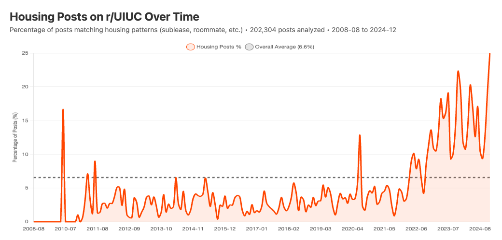

# UIUC Reddit Housing Filter

A Tampermonkey/Greasemonkey userscript to hide sublease and housing-related posts on r/UIUC.



[View interactive chart](housing-analysis.html)

## Why?

Housing posts (subleases, roommate searches, etc.) make up a significant portion of r/UIUC content—sometimes exceeding 15-20% of all posts during peak seasons. This script automatically hides them so you can focus on other content.

## Installation

### Option 1: Direct Install
1. Install [Tampermonkey](https://www.tampermonkey.net/) (Chrome, Firefox, Edge, Safari) or [Greasemonkey](https://www.greasespot.net/) (Firefox)
2. Click on [`uiuc-reddit-housing-filter.user.js`](uiuc-reddit-housing-filter.user.js)
3. Click "Raw" to view the raw file
4. Tampermonkey should prompt you to install—click "Install"

### Option 2: Manual Install
1. Install Tampermonkey or Greasemonkey
2. Open the extension dashboard
3. Click "+" or "Create new script"
4. Delete any template code
5. Copy and paste the contents of `uiuc-reddit-housing-filter.user.js`
6. Save (Ctrl+S / Cmd+S)

## Publishing to Greasy Fork

To share this script with others via [Greasy Fork](https://greasyfork.org/):

1. Create an account at [greasyfork.org](https://greasyfork.org/)
2. Click "Submit a script" in the navigation
3. Either:
   - **Paste code directly**: Copy the contents of `uiuc-reddit-housing-filter.user.js`
   - **Link to GitHub**: Point to the raw file URL for automatic updates
4. Fill in the description and submit

Once published, users can install with one click directly from Greasy Fork.

## What Gets Filtered

The script hides posts matching these patterns (case-insensitive):

| Pattern | Examples |
|---------|----------|
| `sublease`, `sublet`, `sublessee` | "Spring Sublease Available", "Looking for subletter" |
| `roommate` | "Roommate needed", "Looking for roommates" |
| `lease takeover`, `relet` | "Take over my lease", "Relet available" |
| `$XXX/month`, `$XXX/mo` | "$500/month near campus" |
| `1BR`, `2B2B`, `3 bedroom` | "1BR apartment", "2B2B at 309 Green" |

## Debugging

Open browser DevTools (F12) → Console to see which posts are being hidden:

```
[UIUC Housing Filter] Hidden: Spring Sublease Available - 1BR at Green St
```

## Rebuilding the Analysis

The analysis was built using 202,304 historical posts from r/UIUC (August 2008 – December 2024). The data files are too large to include in the repository, but you can rebuild everything:

### 1. Download the data

Download the [Reddit Subreddits dataset](https://academictorrents.com/details/56aa49f9653ba545f48df2e33679f014d2829c10) from Academic Torrents. You only need the `UIUC_submissions.zst` file:

```bash
# Install aria2 (macOS with MacPorts)
sudo port install aria2

# Download the torrent file from Academic Torrents, then:
aria2c --show-files reddit-*.torrent | grep UIUC  # Find the file index
aria2c --select-file=INDEX reddit-*.torrent       # Download just UIUC data
```

### 2. Decompress and analyze

```bash
# Install dependencies
bun install

# Decompress the data
zstd -d reddit/subreddits24/UIUC_submissions.zst -o reddit/subreddits24/UIUC_submissions.ndjson

# Generate the charts
bun run analyze-housing.ts      # Interactive HTML charts
bun run generate-chart-image.ts # PNG export (requires puppeteer)
```

## License

MIT

---

## How This Was Built

This project was built in about 20 minutes through a conversation with [Claude Code](https://claude.ai/code), Anthropic's AI coding assistant. Here's the conversation that created it:

**Human:** Please create a Tampermonkey / Greasmonkey script to block sublease-related posts on the UIUC Reddit sub. You should identify these as any that include "sublease" in the title, for now, case-insensitive and include partial matches. Actually, is there any way to get the list of Reddit post titles for this sub for the past, say, few months so that we can design a good filter?

**Claude:** *[Tried Reddit API and Arctic Shift API, found Academic Torrents dataset]*

**Human:** I actually want to start with a full history of all post titles, so that we can ensure that we're not blocking non-sublease related posts.

**Human:** It looks like they have Torrents posted here: https://academictorrents.com/details/56aa49f9653ba545f48df2e33679f014d2829c10

**Claude:** *[Found UIUC_submissions.zst in the torrent - 56MB covering August 2008 to December 2024]*

**Human:** Can you help with this? Is there a command line Torrent client that you know how to use?

**Human:** I use macports.

**Claude:** *[Used aria2 to selectively download just the UIUC subreddit data]*

**Human:** I'm less worried about false positives than false negatives.

**Claude:** *[Analyzed 202,304 posts, identified patterns: sublease/sublet (~9,500), roommate (~3,000), lease takeover (~440), price patterns (~500), bedroom patterns (~2,100) - totaling ~13,300 housing posts or 6.6%]*

**Human:** Can you also create a graph showing the prevalence of housing-related posts on a per-month basis? I'm curious if that's increased over time.

**Human:** Don't use Python, use bun and TS for this.

**Claude:** *[Created TypeScript analysis script with Chart.js visualization]*

**Human:** Nice. Can you generate a PNG or JPG of just the top graph? I'd like to post this on... where else, Reddit?

**Claude:** *[Used Puppeteer to render and screenshot the chart]*

**Human:** Can we clean up the repository and document what we did together? And what files should we keep? The Reddit data files may be too large to check in, but it would be nice to have a tool to rebuild the graphs.

**Claude:** *[Created .gitignore, cleaned up large files, wrote README with rebuild instructions]*

**Human:** Can you add how long the process took? Oh, and can you add instructions on how to publish this to a site that hosts Tampermonkey scripts?

**Claude:** *[Added Greasy Fork publishing instructions and timing]*

**Human:** Let's also add a checkbox to the UI to enable/disable the filter. Call it "Show Housing" and have it be disabled by default.

**Claude:** *[Added floating toggle UI with localStorage persistence]*

**Human:** Is there a way to stick it in the subreddit sidebar? Maybe above "The University of Illinois at Urbana-Champaign"? And have it match the page styling?

**Claude:** *[Attempted sidebar injection - initially failed because new Reddit uses Shadow DOM]*

**Human:** I still see it floating...

**Claude:** *[After several debugging rounds, discovered the element was inside a Shadow DOM web component. Added deepQuery() helper to pierce shadow boundaries, then fixed duplicate insertion by placing toggle in the light DOM sidebar container]*

**Human:** Beautiful! It works nicely now.

The entire project—userscript, data analysis, chart generation, toggle UI with Shadow DOM handling, and documentation—was created in a single session through natural language conversation. The debugging process for the Shadow DOM issue demonstrated collaborative problem-solving: the human provided console output and HTML snippets while Claude iterated on solutions until it worked.
